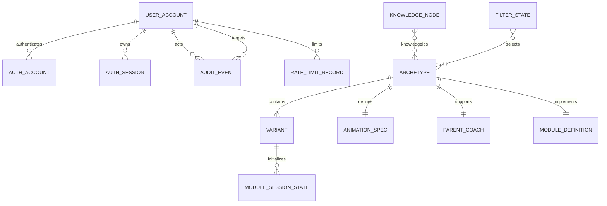

# Data Model: Vue 数学母题学习工作台重构

## 1. Content Entities

### KnowledgeNode

| Field | Type | Rules |
|---|---|---|
| `id` | `KnowledgeId` | `K01`-`K38`，唯一且稳定 |
| `name` | `string` | 非空中文名称 |
| `domain` | `MathDomain` | 运算与数感、数量关系、应用题模型、时间、分数、测量、图形、统计 |
| `term` | `Term` | 上册、下册、跨学期 |
| `source` | `SourceLayer` | 课内、课标、拔高 |
| `prerequisites` | `KnowledgeId[]` | 只引用存在的 K 编号，不得自引用 |
| `masteryGoals` | `string[]` | 至少 1 项 |
| `mistakes` | `string[]` | 至少 1 项 |

### Archetype

| Field | Type | Rules |
|---|---|---|
| `id` | `ArchetypeId` | `M01`-`M39`，唯一且稳定 |
| `title` | `string` | 非空，突出题目模型 |
| `layer` | `SourceLayer` | 课内、课标、拔高 |
| `knowledgeIds` | `KnowledgeId[]` | 至少 1 项且全部存在 |
| `model` | `string` | 一句话说明数量关系 |
| `difficulty` | `Difficulty` | 基础、提高、挑战 |
| `variants` | `Variant[]` | 至少 3 项 |
| `animationSpec` | `AnimationSpec` | 必填 |
| `parentCoach` | `ParentCoach` | 必填 |

### Variant

| Field | Type | Rules |
|---|---|---|
| `id` | `VariantId` | 以所属 M 编号开头，项目内唯一 |
| `title` | `string` | 非空 |
| `parameters` | `Record<string, number>` | 所有值为整数 |
| `promptTemplate` | `string` | 参数占位符必须全部可解析 |
| `solutionSteps` | `string[]` | 至少 2 步 |
| `answerRule` | `string` | 非空且与领域求解器一致 |

### AnimationSpec

| Field | Type | Rules |
|---|---|---|
| `scene` | `string` | 描述场景与数学对象，不描述 UI 装饰 |
| `manipulatives` | `string[]` | 至少 1 个可操作对象 |
| `controls` | `string[]` | 至少包含一个直接操作和复位 |
| `computedValues` | `string[]` | 至少 1 个关键量 |
| `revealSteps` | `string[]` | 至少 2 步 |
| `childFeedback` | `string` | 简短儿童提示 |

### ParentCoach

| Field | Type | Rules |
|---|---|---|
| `talkTrack` | `string` | 一段可直接说给孩子的话 |
| `commonMistake` | `string` | 至少指出一个典型错因 |
| `extensionPrompt` | `string` | 一个不直接给答案的追问 |

## 2. Runtime Entities

### UserAccount

Better Auth `user` 表的扩展视图。

| Field | Type | Rules |
|---|---|---|
| `id` | `string` | 随机不可预测 ID |
| `username` | `string` | 唯一、规范化小写，3-30 字符，创建后不可修改 |
| `displayUsername` | `string` | 管理员和用户看到的登录名 |
| `name` | `string` | 显示名，非空 |
| `email` | `string` | 服务端生成的内部不可投递标识，不在 UI 展示 |
| `role` | `'admin' \| 'user'` | 默认 `user`，服务端控制 |
| `isActive` | `boolean` | 默认 true |
| `validFrom` | `Date` | UTC，必填 |
| `validUntil` | `Date \| null` | UTC；null 表示长期有效，非空时必须晚于 validFrom |
| `mustChangePassword` | `boolean` | 管理员创建/重置后为 true |
| `version` | `number` | 乐观并发控制，每次管理更新递增 |
| `createdAt` | `Date` | UTC |
| `updatedAt` | `Date` | UTC |

### AuthAccount

Better Auth `account` 表，保存 credential provider 的密码哈希关联。密码由认证库安全处理，不进入应用日志、API 响应或审计摘要。

### AuthSession

| Field | Type | Rules |
|---|---|---|
| `id` | `string` | 随机 ID |
| `userId` | `string` | 引用 UserAccount |
| `token` | `string` | 只存在服务端数据库和 HttpOnly Cookie 流程，不返回管理 UI |
| `expiresAt` | `Date` | 创建后最多 12 小时，且不得晚于账号有效期 |
| `createdAt` | `Date` | UTC |
| `updatedAt` | `Date` | 最近活动时间 |
| `ipAddress` | `string \| null` | 仅安全审计使用，按隐私策略处理 |
| `userAgent` | `string \| null` | 仅安全审计使用 |

Session 每次受保护请求检查 `updatedAt`；距最近活动达到 2 小时即为空闲过期。Session 结束后 IP 与 User-Agent 最多保留 30 天，随后删除或不可逆匿名化。

### AuditEvent

| Field | Type | Rules |
|---|---|---|
| `id` | `string` | 唯一 ID |
| `actorUserId` | `string` | 执行操作的管理员 |
| `targetUserId` | `string \| null` | 被管理用户 |
| `action` | `AuditAction` | CREATE_USER、UPDATE_VALIDITY、SUSPEND、RESUME、RESET_PASSWORD、REVOKE_SESSIONS、ROLE_CHANGE |
| `summary` | `jsonb` | 只包含非敏感前后值，不含密码、哈希、Token |
| `requestId` | `string` | 关联服务端请求 |
| `createdAt` | `Date` | UTC，不可由前端指定 |

AuditEvent 仅管理员可读取并保留 365 天；到期后按后台清理任务删除。

### RateLimitRecord

| Field | Type | Rules |
|---|---|---|
| `key` | `string` | 登录名+IP、IP 或管理员 ID 的不可逆派生键 |
| `bucket` | `string` | `login-identity-ip`、`login-ip`、`admin-write` |
| `count` | `number` | 当前窗口请求/失败次数 |
| `windowStartedAt` | `Date` | UTC |
| `expiresAt` | `Date` | 窗口结束后可清理 |

### AccountStatus

由服务端根据当前 UTC 时间计算，不单独持久化：

```ts
type AccountStatus =
  | 'pending'
  | 'active'
  | 'expiring-soon'
  | 'expired'
  | 'suspended'
```

优先级：`suspended` > `pending` > `expired` > `expiring-soon` > `active`。`expiring-soon` 默认表示 7 天内到期，仅用于显示，不改变授权。

### ModuleDefinition

模块注册表中的静态定义。

| Field | Type | Rules |
|---|---|---|
| `id` | `ArchetypeId` | 与蓝图母题一一对应 |
| `component` | `AsyncComponentLoader` | 动态导入对应 Vue 组件 |
| `capabilities` | `ModuleCapabilities` | 声明拖动、图片、步骤、检查等能力 |
| `defaultState` | `Record<string, IntegerValue>` | 只含整数或离散模式 |
| `normalize` | `(state) => state` | 输出合法整数状态 |
| `assets` | `AssetManifest` | 只列当前模块使用的资源 |

### ModuleCapabilities

```ts
interface ModuleCapabilities {
  interactive: true
  imageAnimation: boolean
  draggable: boolean
  steppedReveal: boolean
  answerCheck: boolean
  resettable: true
}
```

### ModuleSessionState

| Field | Type | Rules |
|---|---|---|
| `archetypeId` | `ArchetypeId` | 当前母题 |
| `variantId` | `VariantId` | 属于当前母题 |
| `parameters` | `Record<string, number>` | 全部为整数且通过模块 normalize |
| `stepId` | `string` | 属于当前模块步骤集合 |
| `feedback` | `FeedbackState` | idle、hint、correct、adjust |
| `answerRevealed` | `boolean` | 默认 false |
| `revision` | `number` | 每次复位或切换子题递增，用于取消旧动画 |

### FilterState

```ts
interface FilterState {
  query: string
  domains: MathDomain[]
  terms: Term[]
  layers: SourceLayer[]
  difficulties: Difficulty[]
  interactiveOnly: boolean
  imageAnimationOnly: boolean
}
```

所有字段均可序列化到 URL。空数组表示不限制；不在 URL 中写默认值。

### FeedbackState

| State | Meaning | UI Behavior |
|---|---|---|
| `idle` | 尚未检查 | 不显示反馈面板 |
| `hint` | 用户主动请求提示 | 只指向下一观察点 |
| `correct` | 当前关系成立 | 短暂高亮并允许下一步 |
| `adjust` | 参数或操作不成立 | 指出需调整的量，不直接给答案 |

## 3. Relationships



## 4. Validation Invariants

1. 知识点总数为 38，母题总数为 39，子题总数为 117，除非规格明确修订。
2. 每个 Archetype 至少关联一个 KnowledgeNode，至少包含 3 个 Variant。
3. 每个互动母题必须存在 ModuleDefinition；注册表中不得存在蓝图外 M 编号。
4. Variant 参数、默认状态、计算中间值和答案必须为整数。
5. 除法和比例模型的 normalize 必须生成整除组合，不能使用四舍五入掩盖小数。
6. 图片动画的 `assets` 必须引用存在文件；重复对象资源必须允许动态实例化。
7. 切换 Variant 后必须由该 Variant 参数重新初始化 ModuleSessionState。
8. URL 过滤条件解析失败时回退为空条件，不污染 store。
9. `validUntil` 非空时必须严格晚于 `validFrom`。
10. 账号授权要求：有效 Session、`isActive=true`、`now >= validFrom`、`validUntil=null || now < validUntil`。
11. `mustChangePassword=true` 时只允许访问 Session、修改密码和退出接口。
12. 普通用户不能写入 role、isActive、validFrom、validUntil 或 mustChangePassword。
13. 停用、密码重置、角色变化或有效期收紧必须在同一管理流程中撤销全部 Session。
14. 最后一个有效管理员不能被停用、删除或降级。
15. 更新用户必须提交当前 version；不匹配时返回冲突，不能覆盖较新数据。
16. AuditEvent 不得包含密码、密码哈希、Session token、完整 Cookie 或认证头。
17. 管理员用户写入、对应 AuditEvent 和必要的 Session 删除必须在同一事务中成功或回滚。
18. `username` 和内部认证邮箱创建后不可修改；显示名是可编辑身份字段。
19. Session 绝对时长为 12 小时、空闲时长为 2 小时，并受 `validUntil` 上限约束。
20. AuditEvent 保存 365 天；Session 网络元数据在 Session 结束后最多保存 30 天。

## 5. State Transitions

### Account Lifecycle

```text
created + before validFrom -> pending
pending + reaches validFrom -> active
active + within 7 days of validUntil -> expiring-soon
active/expiring-soon + reaches validUntil -> expired + revoke sessions
any non-suspended + admin suspends -> suspended + revoke sessions
suspended + admin resumes -> derived status from current validity
expired + admin extends validUntil -> active or pending; old sessions remain revoked
```

### First Login

```text
credentials accepted
  -> validity policy accepted
  -> mustChangePassword=true
  -> restricted session
  -> password changed
  -> revoke other sessions
  -> mustChangePassword=false
  -> full role permissions
```

### Lesson Session

```text
uninitialized
  -> ready (route + variant loaded)
  -> interacting (parameter or object changed)
  -> hint | correct | adjust (feedback requested)
  -> interacting (continue)
  -> ready (reset or variant change)
```

### Module Loading

```text
idle -> loading -> ready
               -> asset-fallback
               -> error -> retry -> loading
```

缺少图片只能进入 `asset-fallback`，不能让数学功能进入不可用状态。

## 6. Existing Data Mapping

- `data/grade3-math-blueprint.json.knowledgeNodes` → `KnowledgeNode[]`
- `data/grade3-math-blueprint.json.archetypes` → `Archetype[]`
- `knowledgeToArchetypes` 可在加载时校验后由关系计算，不作为第二事实源长期维护。
- `src/core.js` 计算函数 → `packages/shared/src/domain/*` 纯 TypeScript 函数。
- `src/core.js` 图片帧映射 → 各 `ModuleDefinition.assets`。
- `src/app.js` 本地 state → Router、Pinia 和各模块 `ModuleSessionState`。
- 新建 Better Auth user/account/session/verification/rateLimit 表及 Drizzle `audit_events` 表。
- 现有项目无账号数据；首个管理员由受控 seed 命令创建。
