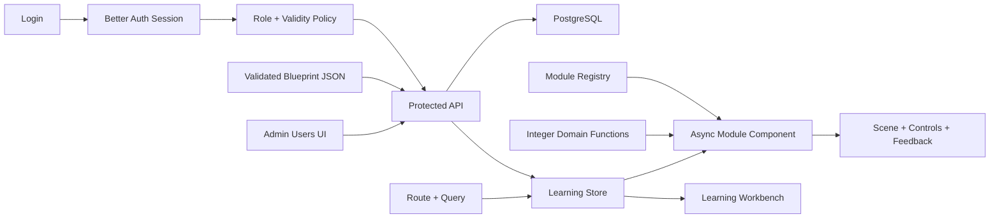

# Implementation Plan: Vue 数学母题学习工作台重构

**Branch**: `001-vue-learning-workbench` | **Date**: 2026-06-22 | **Spec**: [spec.md](./spec.md)

**Input**: Feature specification from `/specs/001-vue-learning-workbench/spec.md`

## Summary

将现有原生 HTML/CSS/JS 单页应用重构为 Vue 3 + TypeScript + Vite 前端，并新增 Hono + Better Auth + PostgreSQL 鉴权 API。保留现有蓝图数据、数学计算结果和图片资产，使用类型化领域层、母题组件注册表、统一动画外壳和可访问筛选导航替代当前大型脚本及 39 路条件分派。学习 UI 采用“左侧领域筛选、顶部高频筛选、中央题目大舞台、右侧陪练抽屉”；管理员使用独立的紧凑用户管理界面。

## Technical Context

**Language/Version**: TypeScript 5.x、Vue 3.x，Node.js 满足当前 Vite 官方最低版本要求

**Primary Dependencies**: Vue、Vite、Vue Router、Pinia、Reka UI、Lucide Vue Next、Hono、Better Auth Admin/Username plugins、Drizzle ORM、PostgreSQL driver

**Storage**: PostgreSQL 保存用户、账号、会话、有效期和审计；蓝图 JSON 由受保护 API 加载；非敏感 UI 偏好可使用 Web Storage，鉴权凭证禁止使用 Web Storage

**Testing**: Vitest、Vue Test Utils、Playwright、Hono request tests、数据库集成测试、`vue-tsc --noEmit`、JSON Schema 校验

**Target Platform**: 现代桌面与移动浏览器；Node.js API 与 PostgreSQL；同源 HTTPS 部署

**Project Type**: Web 应用，npm workspaces 管理 Vue 前端、Hono API 和共享契约

**Performance Goals**: 登录后首屏 2 秒内可交互；收到蓝图响应后 300ms 内显示题目骨架；五个基准动画 5 秒平均不低于 55fps；母题组件按需加载

**Constraints**: 无公开注册；两种角色；服务器强制有效期；39 个母题和 117 个子题完整迁移；全程整数；保留现有图片；精修图片统一使用 image2 分层资产；三种目标视口无溢出；支持减少动态效果

**Scale/Scope**: 38 个知识点、39 个母题、117 个子题、36 组母题图片资产、5 个高质量交互基准模块、1 个后续动画精修路线图；最多 10,000 个账号、500 个并发有效 Session

## Constitution Check

*GATE: Must pass before Phase 0 research. Re-check after Phase 1 design.*

| Gate | Status | Evidence |
|---|---|---|
| 学习目标优先 | PASS | 题目头与动画舞台占据主内容，筛选和陪练使用外围区域 |
| 数据单一事实源 | PASS | 蓝图 JSON 转换为类型化仓库，组件不复制内容 |
| 可操作与可复位 | PASS | `AnimationModule` 契约强制参数、步骤、反馈、复位 |
| 儿童与家长双层信息 | PASS | 孩子主舞台与家长抽屉分离 |
| 响应式与无障碍 | PASS | Reka UI 基础组件、三视口验收、减少动态效果 |
| 测试先行与增量迁移 | PASS | 按批次迁移并保留现有结果对照测试 |
| 简单架构 | PASS | Web、API、Shared 三个 workspace，无通用动画引擎 |
| 服务端鉴权与最小权限 | PASS | Better Auth 服务端会话、固定角色、有效期中间件、审计日志 |

## Architecture

### Layer Boundaries

1. **Auth API**: Better Auth 登录、会话、角色和管理员用户操作。
2. **Access Policy**: 每次请求检查启用状态、生效时间、到期时间和角色。
3. **Content API**: 鉴权后加载、校验和查询蓝图数据。
4. **Domain**: 纯 TypeScript 数学函数、参数约束、整数生成和格式化。
5. **Module Registry**: M 编号到 Vue 组件、默认状态、能力标记和资产的唯一映射。
6. **Learning UI**: 路由、筛选、题目头、舞台外壳、控制栏、反馈和陪练抽屉。
7. **Admin UI**: 用户列表、创建、有效期、状态、密码重置和会话撤销。
8. **Module Scenes**: 每个母题的题目专属 SVG/CSS/图片场景与交互。

依赖方向固定为 `UI → API Client/Registry → Shared Contracts/Domain` 与 `API → Auth/Policy/Repository → Database`。Domain 和 Shared Contracts 不得导入 Vue 或 Hono。

### Runtime Flow



### State Ownership

- Router owns current `archetypeId`, `variantId` and serializable filters.
- Better Auth HttpOnly Cookie owns authentication credential; Vue stores only safe session profile and loading state.
- Pinia owns cross-page UI state: sidebar, parent drawer, filter draft, current session summary and non-sensitive current user profile.
- Each module component owns transient animation state and exposes reset/check operations through the module contract.
- Domain functions own computed values; Vue state never stores a second manually maintained answer.

## UI Composition

```text
AppShell
├── AppTopbar
│   ├── GlobalSearch
│   ├── QuickFilters
│   └── MobileFilterTrigger
│   ├── AdminEntry
│   └── AccountMenu
├── KnowledgeSidebar / FilterDrawer
├── RouterView
│   ├── LibraryView
│   └── LessonView
│       ├── ProblemHeader
│       ├── AnimationStageShell
│       │   └── AsyncModuleScene
│       ├── ModuleControlBar
│       └── LearningFeedback
└── CoachDrawer
    ├── VariantList
    └── ParentCoach

LoginView
├── LoginForm
└── AuthStatus

AdminUsersView
├── UserFilters
├── UserTable / MobileUserList
├── CreateUserDrawer
└── UserDetailDrawer
```

## Module Migration Strategy

### Batch A - Foundation And Baselines

M09、M12、M20、M21、M39。先用高质量现有模块验证注册表、舞台外壳、图片分层、参数同步和响应式能力。

### Batch B - Operations And Quantity Relations

M01-M08、M10-M19。抽取运算步骤、整数步进器、关系三角、线段图和流程控制共享组件。

### Batch C - Time And Fractions

M22-M27。抽取日历、时间轴、等分整体、分数条和整数约束。

### Batch D - Geometry, Measurement And Statistics

M28-M38。抽取网格、尺带、形状拖动、周长描线、三角形分类和柱状图基础能力。

每个批次完成条件：计算对照、组件测试、目标视口截图、键盘路径和资源加载全部通过。

### Batch E - Animation Delight Upgrade

M01-M39 逐个精修。M09、M12、M20、M21、M39 作为基准保留方向；M01、M02、M03、M31 作为第二阶段样板验证 image2 分层资产、动态对象和轻幽默反馈。每个标记为“已精修”的母题必须通过大舞台、整数参数、减少动态、三视口和断图检查。

## Data Migration

1. 保留 `data/grade3-math-blueprint.json` 作为内容源，由受保护 Content API 返回。
2. 将 Schema 迁移为构建时可执行校验，并生成或维护对应 TypeScript 类型。
3. 将 `src/core.js` 中纯函数按领域拆分为 `packages/shared/src/domain/*`，保持输入输出兼容。
4. 将 `moduleImageFrameSets` 和特殊资产映射移入 `apps/web/src/modules/registry.ts` 与各模块资产文件。
5. 删除 UI 层中的硬编码内容和 `if (module.id === ...)` 分派。
6. 创建 Better Auth/Drizzle 数据表和有效期字段，初始管理员通过受控 seed 命令创建。
7. 现有项目无用户数据，不需要账号迁移；部署前必须完成首个管理员引导。

## Authentication And Authorization

- Better Auth 启用 Email/Password、Username 和 Admin plugins；无公开 sign-up 页面。
- 管理员创建用户时由服务端生成不可投递内部邮箱，用户只使用登录名。
- `isActive`、`validFrom`、`validUntil`、`mustChangePassword` 作为服务端用户附加字段，禁止普通用户输入。
- 用户名创建后不可修改；显示名可由管理员更新，内部认证邮箱保持不变。
- 会话使用数据库存储和 HttpOnly Cookie；生产环境 `Secure`、`SameSite=Lax`、host-only；绝对有效期 12 小时、空闲超时 2 小时，且不超过账号有效期。
- Hono 中间件每次解析会话后执行有效期策略；不使用长时间 Cookie 缓存绕过状态变化。
- 普通用户只拥有学习权限；管理 API 必须同时满足有效会话和 `admin` 角色。
- 用户停用、密码重置、角色变化或有效期收紧后撤销全部会话。
- 登录、用户创建、有效期修改、启停、密码重置和撤销会话写入审计日志。
- 用户写操作、审计和必要的 Session 撤销在同一数据库事务中提交，失败则整体回滚。
- 登录按“登录名 + IP”5次/15分钟和 IP 30次/15分钟限流；管理写操作每管理员 30次/分钟。来源和 CSRF 检查保持启用，生产 trusted origins 只列真实域名。

## Operations And Recovery

- `GET /api/health/live` 只报告进程存活；`GET /api/health/ready` 检查数据库连接但不返回内部细节。
- API 启动前校验 `DATABASE_URL`、至少 32 字节的 `BETTER_AUTH_SECRET` 和精确 `APP_ORIGIN`。
- PostgreSQL 每日备份、保留 30 天；季度恢复演练目标 RPO 24 小时、RTO 4 小时。
- 生产迁移执行前生成备份；迁移必须有回退迁移或文档化恢复步骤。
- 审计保留 365 天；仅管理员可查询。Session 网络元数据在 Session 结束后 30 天内删除或匿名化。

## Testing Strategy

### Unit

- 所有领域计算函数保留或扩充现有结果测试。
- 参数规范化、整数约束、筛选查询和 URL 序列化单独测试。
- 蓝图仓库测试 ID 引用、总数和必填字段。

### Component

- `ProblemHeader`、筛选抽屉、控制栏、步骤轨道、反馈和陪练抽屉。
- 每个母题至少测试默认状态、一个参数变化、一个步骤变化和复位。
- 图片模块测试动态对象数量，而不是只测试图片 URL。

### End To End

- 搜索并打开 M20。
- 筛选“拔高 + 图片动画”并清除条件。
- M39 四步书本数量变化。
- M12 拖动与路程计算。
- 手机筛选抽屉和家长陪练抽屉。
- 键盘导航及减少动态效果。
- 有效、未生效、已到期、已停用账号登录。
- 管理员创建用户、修改有效期、暂停和强制下线。
- 普通用户直接访问管理路由/API 被拒绝。
- `/api/blueprint` 鉴权、ETag、无 payload 的未授权响应。
- Session 12 小时绝对时长、2 小时空闲超时和账号到期上限。
- 登录/管理限流阈值、原子回滚和审计保留。
- 性能预算、数据库迁移和季度恢复演练。

### Visual

- 对 M09、M12、M20、M21、M39 在三种目标视口保存基准截图。
- 检查舞台非空、对象在框内、文字不重叠、抽屉不遮挡主要操作。

## Performance And Asset Plan

- 母题组件通过动态 import 按需加载。
- 图片按母题目录分组；首屏只预加载当前母题首帧或对象图。
- 重复对象使用同一资源实例和 CSS 变换，不生成重复大图。
- 拖动使用 `transform`，避免频繁改变布局属性。
- 统一取消旧动画，防止快速操作积累队列。
- 构建输出检查大体积资源和未引用旧帧。

## Project Structure

### Documentation

```text
specs/001-vue-learning-workbench/
├── spec.md
├── ui-ux-spec.md
├── plan.md
├── research.md
├── data-model.md
├── quickstart.md
├── contracts/
│   ├── module-contract.md
│   ├── navigation-contract.md
│   └── auth-api.md
├── checklists/
│   └── requirements.md
└── tasks.md
```

### Source Code

```text
apps/
├── web/
│   ├── src/
│   │   ├── app/
│   │   ├── auth/
│   │   ├── components/
│   │   ├── modules/
│   │   ├── styles/
│   │   └── views/
│   └── tests/
└── api/
    ├── src/
    │   ├── auth/
    │   ├── admin/
    │   ├── content/
    │   ├── db/
    │   ├── config/
    │   ├── health/
    │   ├── middleware/
    │   └── audit/
    └── tests/

packages/
└── shared/
    └── src/
        ├── contracts/
        ├── domain/
        └── content/

tests/
├── e2e/
└── visual/
```

**Structure Decision**: 使用三个 npm workspaces：Vue Web、Hono API、共享类型/领域。API 在生产环境同源提供 Web 构建与 `/api`；开发环境 Vite 代理 API。现有 `assets/` 与 `data/` 在迁移期间保留，最终移动必须一次完成并有测试覆盖。

## Delivery Phases

### Phase 0 - Research

完成依赖选择、状态边界、动画策略、数据迁移和测试策略，见 [research.md](./research.md)。

### Phase 1 - Design And Contracts

完成数据模型、母题组件契约、导航契约和快速验收，见 [data-model.md](./data-model.md)、[contracts](./contracts) 和 [quickstart.md](./quickstart.md)。

### Phase 2 - Tasking

按共享基础和可独立验收的用户故事生成任务，见 [tasks.md](./tasks.md)。

## Complexity Tracking

无宪章违规。三个 workspace 分别承载前端、API 和共享契约，满足鉴权需求且未超过复杂度门。Better Auth 避免手写认证；Hono、Drizzle 和 PostgreSQL为用户有效期、会话撤销和审计提供必要服务端边界。不引入通用动画引擎。
