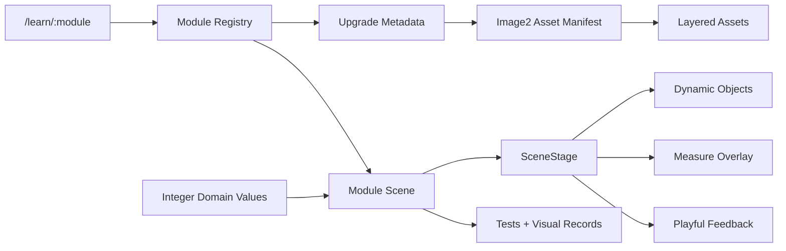

# Implementation Plan: 交互动画精修与 image2 分层资产升级

**Branch**: `002-animation-delight-upgrade` | **Date**: 2026-06-24 | **Spec**: [spec.md](./spec.md)

**Input**: Feature specification from `/specs/002-animation-delight-upgrade/spec.md`

## Summary

在现有 Vue 数学母题工作台上，建立一套动画精修体系：用 image2 生成可拆分图片图层，用共享大舞台 primitives 组装交互，用模块级状态记录和验收文档追踪 39 个母题的精修进度。M09、M12、M20、M21、M39 保留当前方向并接入统一质量门；M01、M02、M03、M31 作为第二阶段样板，再按领域批次推广到其余模块。

## Technical Context

**Language/Version**: TypeScript 5.x、Vue 3.x、Node.js 20+

**Primary Dependencies**: Vue、Vite、Vue Router、Pinia、Vitest、Vue Test Utils、Playwright、现有 Hono/Better Auth API

**Storage**: 动画精修状态和 image2 manifest 首先以仓库文件保存；账号和鉴权继续使用 PostgreSQL，不新增数据库表

**Testing**: Vitest、Vue Test Utils、Playwright、`vue-tsc --noEmit`、JSON/manifest 校验、三视口视觉验收

**Target Platform**: 现代桌面和平板/手机浏览器；同源部署沿用现有服务

**Project Type**: Vue 前端功能升级，不改变 API 鉴权边界

**Performance Goals**: 精修动画连续操作保持接近 60fps；大量对象场景通过分组或合成层避免卡顿；图片按模块懒加载

**Constraints**: 39 个母题和 117 个子题不丢失；所有题目保持整数；image2 图片不烘焙答案；不引入全局重型动画引擎；减少动态可用

**Scale/Scope**: 39 个模块、至少 39 组 asset manifest、5 个保留基准模块、4 个第二阶段样板、后续 30 个批量精修模块；image2 资产按批次生成，不在第一刀一次性生成全部图片

## Constitution Check

| Gate | Status | Evidence |
|---|---|---|
| 学习目标优先 | PASS | 主舞台、关键量和关系式是验收核心 |
| 数据驱动与单一事实源 | PASS | 题干和计算仍来自蓝图和领域函数，图片不写答案 |
| 可操作、可解释、可复位 | PASS | FR-003、FR-006、FR-008 明确要求 |
| 儿童与家长双层信息 | PASS | 轻幽默反馈不嘲笑孩子，家长话术保留 |
| 可访问、响应式与稳定布局 | PASS | 三视口、减少动态、无溢出为成功标准 |
| 测试先行与增量迁移 | PASS | 先样板后批次，每批验收 |
| 简单架构与明确边界 | PASS | 沿用 Vue/CSS/Web Animations API，不做通用低代码动画引擎 |
| 服务端鉴权与最小权限 | PASS | 本特性不扩大账号/API 权限范围 |

## Architecture

### Layer Boundaries

1. **Upgrade Metadata**: 记录每个 M 编号的精修状态、批次、质量门和验收链接。
2. **Image2 Asset Manifest**: 记录背景、对象、状态帧、数学道具、反馈道具和 fallback。
3. **Shared Scene Primitives**: 提供大舞台、图层、量线、反馈气泡、步骤轨道和整数控件。
4. **Module Scenes**: 每个母题根据自己的数学模型组合图层、控件和反馈。
5. **Acceptance Tests**: 断图、对象状态、整数、减少动态和三视口检查。
6. **Documentation**: 路线图、验收记录和 SpecKit 状态同步。

依赖方向固定为 `Module Scene -> Shared Scene Primitives -> Asset Manifest -> Static Assets`。数学计算继续依赖现有领域函数，图片资产不得成为答案来源。

### Runtime Flow

## Module Upgrade Strategy

### Batch 0 - Contract And Shared Primitives

建立 asset manifest、upgrade metadata、共享舞台组件和测试工具。此批次不重画具体模块，只让后续模块有统一接入点。

### Batch 1 - Baseline Preservation

M09、M12、M20、M21、M39。目标是“不推倒重写”，把已有好方向接入统一质量门。

### Batch 2 - New Pattern Samples

M01、M02、M03、M31。目标是验证四类核心模式：运算顺序、括号优先、位值进位、图形切补。

### Batch 3 - Operations And Applications

M04-M08、M10-M19。目标是把运算、线段、周期、流程、搭配和分配题统一迁移到大舞台。

### Batch 4 - Time, Fractions, Geometry And Statistics

M22-M38。目标是完成日历、时间轴、分数、单位、面积、周长、对称、三角形和统计图的精修。

### Batch 5 - Full Acceptance

全量跑自动化、三视口和人工验收，更新文档与母题库状态。

### First Implementation Slice

1. 完成 upgrade status、image2 manifest 类型和校验。
2. 完成 `SceneStage`、`SceneLayer`、`MeasureOverlay`、`PlayfulFeedbackBubble` 和整数控制守卫。
3. 将 M09、M12、M20、M21、M39 接入新质量门，确保不降低已有体验。
4. 生成并接入 M01、M02、M03、M31 的 image2 样板资产。
5. 只有样板验收通过后，才批量推进其余模块。

## Data And Asset Migration

1. 保留 `data/grade3-math-blueprint.json` 不作为本特性的改写对象。
2. 在 Web 模块目录新增 asset manifest 和 upgrade status。
3. image2 生成资产进入 `apps/web/src/assets/module-frames/mXX/image2/`。
4. 模块 manifest 进入 `apps/web/src/modules/mXX/image2-manifest.ts`，只记录仓库内相对路径。
5. 每个资产记录对应提示词、角色、透明度、可重复渲染和 fallback。
6. 可动透明对象优先保存为 PNG；背景和 fallback 优先保存为 WebP。
7. 原整图资产可作为参考或 fallback，但不可作为动态数量的唯一表现。

## Testing Strategy

### Unit

- asset manifest schema。
- upgrade status 完整性。
- 整数控制守卫。
- 反馈触发条件纯函数。

### Component

- `SceneStage` 图层渲染。
- `MeasureOverlay` 标签和量线。
- `PlayfulFeedbackBubble` reduced motion。
- 样板模块对象状态和复位。

### E2E

- M09、M12、M20、M21、M39 保留核心路径。
- M01、M02、M03、M31 样板路径。
- 三视口无溢出。
- 图片加载和对象状态断言。

### Visual Acceptance

- 每批记录截图、断图结果、减少动态结果和失败项。
- 对 image2 资产风格一致性做人工检查。

## Complexity Tracking

| Concern | Decision | Reason |
|---|---|---|
| 不引入 GSAP 或 Canvas 全量重写 | 使用 Vue + CSS transition + Web Animations API | 当前需求主要是对象移动、数量变化和步骤反馈，原生能力足够 |
| 不新增数据库表 | 精修状态保存在仓库 manifest 和文档 | 这是内容和前端资产治理，不需要运行时用户数据 |
| image2 资产不一次性全部生成 | 按样板和批次推进 | 降低返工风险，先验证资产拆层是否正确 |

## Risk And Mitigation

- **资产过多导致加载慢**: 按模块懒加载，fallbackStill 只在需要时加载。
- **幽默反馈过量**: 每屏只允许一个主要反馈，并由验收记录确认不遮挡。
- **图片生成带入文字或数字**: manifest 验收将其视为失败，必须重生成或处理。
- **模块实现分散**: 用共享 stage primitives 和合同测试约束共性。

## Documentation Outputs

- [spec.md](./spec.md)
- [plan.md](./plan.md)
- [tasks.md](./tasks.md)
- [research.md](./research.md)
- [data-model.md](./data-model.md)
- [ui-ux-spec.md](./ui-ux-spec.md)
- [quickstart.md](./quickstart.md)
- [contracts/animation-module-contract.md](./contracts/animation-module-contract.md)
- [contracts/image2-asset-contract.md](./contracts/image2-asset-contract.md)
